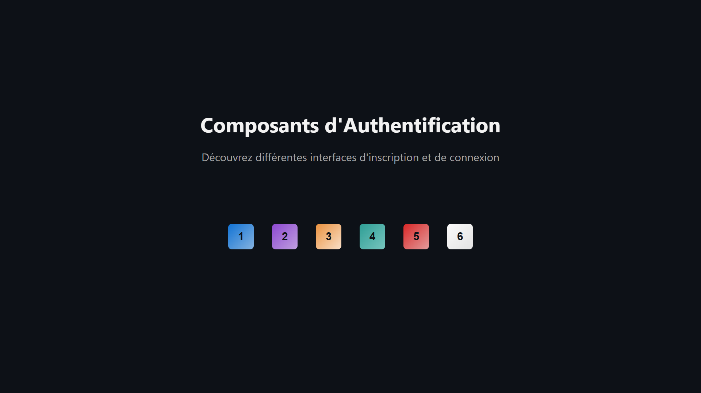

<div align="center">  
  <a href="https://components-authentication.vercel.app" target="_blank">  
      
  </a>
  </br></br>  
  <h3 align="center">🔐 Composants d'Authentification</h3>  
</div>

## <br /> 📌 Sommaire

&nbsp;&nbsp;&nbsp; 🎨 &nbsp; [**Introduction**](#introduction)<br />
&nbsp;&nbsp;&nbsp; 🛠️ &nbsp; [**Technologies**](#technologies)<br />
&nbsp;&nbsp;&nbsp; 🎯 &nbsp; [**Fonctionnalités**](#fonctionnalités)<br />
&nbsp;&nbsp;&nbsp; 🚀 &nbsp; [**Installation**](#installation)<br />

## <br /> <a name="introduction">🎨 Introduction</a>

Ce projet présente une collection de composants React d’authentification modernes, conçus pour être facilement intégrés dans n’importe quelle application web.

Chaque variation `auth1` à `auth6` propose un design distinct, combinant :

- Formulaires stylisés pour la connexion et l’inscription
- Responsive design pensé mobile & desktop
- Architecture modulaire et facilement réutilisable

Le but est d’offrir aux développeurs des bases UI prêtes à l’emploi, avec un code propre et personnalisable, pour tout projet nécessitant une interface d’authentification.

## <br /> <a name="technologies">🛠️ Technologies</a>

- React 18 + Vite pour un développement rapide
- CSS natif modulaire (1 fichier par composant)
- Hooks React : `useState`, `useEffect`
- Convention BEM : `authX__element`
- Aucun framework UI : 100% custom
- Déploiement sur [Vercel](https://components-authentication.vercel.app/)

## <br /> <a name="fonctionnalités">🎯 Fonctionnalités</a>

- Interface Login / Signup intégrée
- Champs contrôlés avec placeholder flottant
- Affichage / Masquage du mot de passe
- Structure modulaire par dossier : facile à copier / intégrer
- Comportement responsive adapté aux petits écrans
- Parfait pour : landing pages, dashboards, SaaS, MVP, etc.

## <br /> <a name="installation">🚀 Installation</a>

### ✅ Pré-requis

- 🛠️ **[Git](https://git-scm.com/)**
- 🔧 **[Node.js](https://nodejs.org/fr/)**
- 📦 **[npm](https://www.npmjs.com/)**

### 📥 Cloner le projet

```bash
git clone https://github.com/ValentinMadiot/components-authentication_ui.git
```

### ▶️ Lancer l’application

#### Frontend (port : 5173)

```bash
cd components-authentication_ui
npm install
npm run dev
```
